**DS 4400 Final Project: Detecting Credit Card Fraud With Machine Learning**
Nick Bagley and Will Conti
Spring 2021

**Problem Statement**
The problem that we are trying to solve is how to defend against credit card fraud.
This is a classification problem, and the machine learning algorithm should be able to
classify a given transaction as either being valid or fraudulent. This is helpful to both the
individual customer using the card and to the banks that supply the cards. By being able
to flag a transaction as fraudulent a bank can put a hold on the purchase and contact the
customer to confirm its validity. This reduces the risk that a customer gets their account
compromised, or the risk that they do not catch the faulty transaction themselves and lose
money from it. It also saves the bank money because they will not have to refund the
customer for fraudulent transactions if they are able to catch them before they execute.
This is an important problem to solve because it can really ruin somebody’s finances if
they are a victim of credit card fraud that goes uncaught. There were 271,823 cases of
credit card fraud reported in the United States in 2019, and a total of $24.2 billion was
lost due to credit card fraud worldwide in 2018. The problem is extremely widespread
and affects millions of stakeholders.
From a machine learning perspective there are a few key factors to consider. We
determined that the most important thing in our models should be the power to correctly
predict fraud. It is crucial to catch as many fraudulent transactions as possible, even if
that means it may identify some valid transactions as fraud. Customers would rather
validate a transaction that was a false alarm than suffer a financial loss from a missed
fraud case.

**References**
Dataset:
https://www.kaggle.com/kartik2112/fraud-detection?select=fraudTest.csv
Research:
https://paymentdepot.com/blog/credit-card-fraud-detection/#:~:text=Credit%20card%20fraud%20detection%20is,an%20illegitimate%20credit%20card%20transaction.
https://spd.group/machine-learning/credit-card-fraud-detection/
https://machinelearningmastery.com/framework-for-imbalanced-classification-projects/
https://www.fisglobal.com/en/insights/merchant-solutions-worldpay/article/6-things-to-look-for-in-a-credit-card-fraud-detection-solution
https://machinelearningmastery.com/random-oversampling-and-undersampling-for-imbalanced-classification/
Presentation Slides:
https://docs.google.com/presentation/d/1TciXYUESaDTu0w-fcPD1raNOIjaU8cHWZWmp-p7h130/edit?usp=sharing
Code Notebook:
https://github.com/wconti27/DS4400_Final_Project/blob/main/ML_Project.ipynb

**Dataset and Exploratory Analysis**
The dataset that we used is the Credit Card Transactions Fraud Detection Dataset
from Kaggle, foundhere. We are unable to access real credit transaction data due to
privacy laws, so this dataset contains simulated transactions of 1000 different customers
between 800 different merchants. This simulation tool was created by Brandon Harris,
and is written in Python using the ‘faker’ library to generate the list of transactions. The
data was run over a time series of January 1, 2019 to December 31, 2020. This structure
allowed us to create new features that were aggregated by time and date of transaction.
The dataset is extremely large. The data was already split into two csv files, one
for training and one for testing. The training dataset contained 1.3 million transactions,
and the testing dataset contained another 500,000 transactions. There were initially 23
columns in the dataset. A snapshot of the head of the original dataset is shown below.
This is broken up into two images in order to clearly see all of the features without
having the text be too small or stretched out. Both of these images show the same five
transactions.

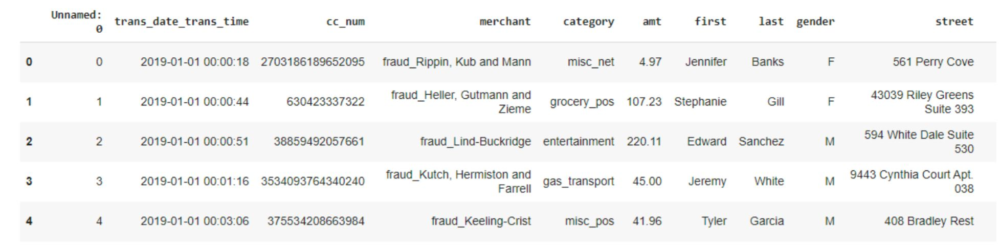
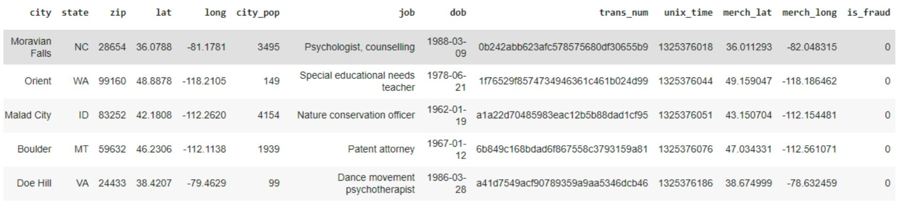
These are the initial columns given to us in the dataset. The final column ‘is_fraud’ is our
target variable in our classification. A value of 0 indicates that the transaction is valid,
and a value of 1 shows that it is fraudulent. Our next step was to remove any features that
are not relevant to the problem. We did some external research on credit card fraud to
find out what features are typically important in detecting it. We combined this with some
analysis of our own in order to see which features could be deleted. This led us to drop
columns such as name, date of birth, gender, and address.
Once we removed irrelevant columns we started on feature engineering in order to
add some predictive features of our own. This started with a one-hot encoding of the
category feature so that it could be used by our model. Then we ran some extensive
aggregation functions on our dataset. We used the credit card number of the transaction in
order to iteratively find the means and standard deviations of the amount, latitude, and
longitude features. These were applied to every row, getting updated on every new
transaction. We also found the difference between the transactions latitude and longitude
and the average longitude and latitude for that credit card number. This shows how far
away the transaction took place from where that customer lives, which is often a strong
indicator of fraud. We applied the difference to the amount feature as well, showing how
far off the transaction’s amount is from the average amount for that customer. One of the
final and most important aggregations that we applied was to keep track of the past frauds
for each credit card number. Below are some of the visualizations we produced to see the
feature correlation after we applied our engineering functions to the dataset.

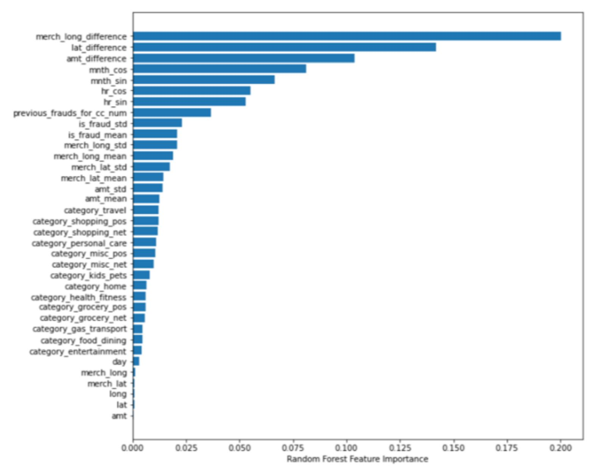
This is a chart of feature importance generated from the Random Forest algorithm.
The features that are most strongly correlated with the target are the differences between
the longitude, latitude, and amount. This coincides with the research we did on credit
card fraud, and also the intuitive sense of what might indicate a fraudulent transaction.
This chart also shows an interesting ranking of purchase categories in terms of fraud.

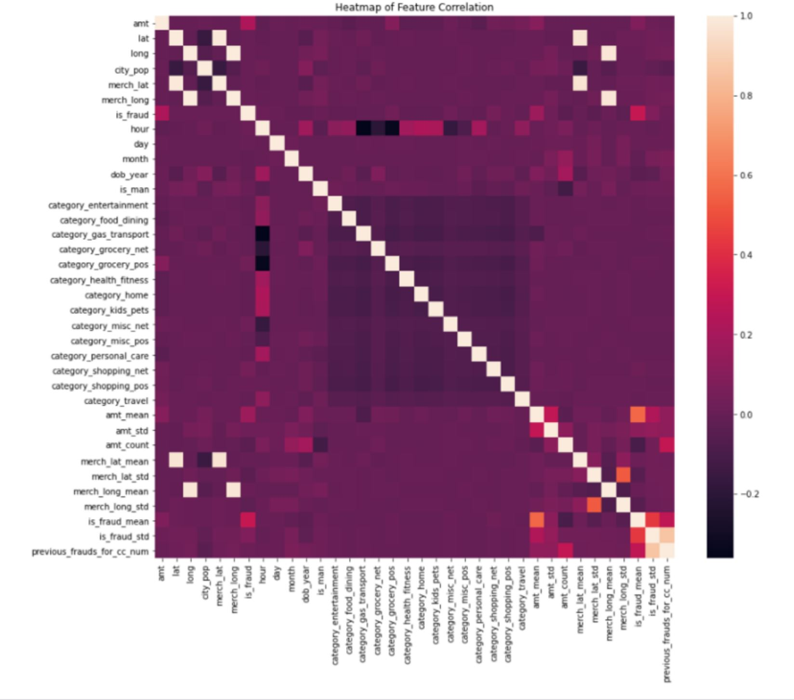
This heatmap shows correlation between different features. This chart provides us
with some interesting insights. The customer longitude and latitude is strongly correlated
to the merchant longitude and latitude. This is why the difference between the
transaction’s location and the average location is so important in predicting fraud.
Purchases made far from a customer’s address are more likely to be fraudulent. Below
we will show some visualizations that look at individual features in more depth.

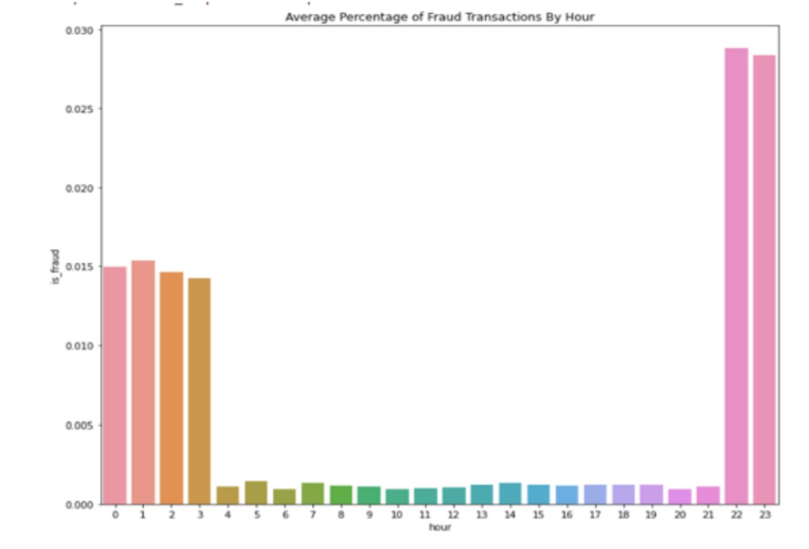
Here we can see the correlation between the hour of the purchase and whether the
transaction is fraudulent. Transactions that are made during business hours are very rarely
fraud. Most credit card fraud occurs between 10:00 p.m and 3:00 a.m, so this is
something that our model will pick up on and use to aid its predictions.

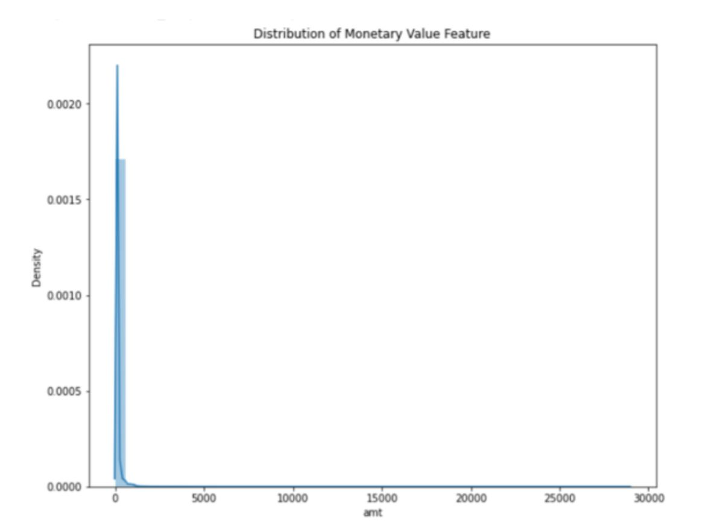
This chart shows the range of different amounts found across the transaction data.
Most credit card transactions are made with relatively small amounts of money. However,
the dataset does contain outliers. Transactions with large amounts are rare in the dataset.
This can be an indicator of fraud if the amount is abnormal compared to the averages in
the data.
Through this exploratory analysis of our dataset we were able to come up with a
final set of 35 features to predict our target variable. We experimented with removing and
adding some different features from this set, but we found that our models performed best
with this combination. We scaled the values in the dataset using a normalization function
in Python, and then we had a dataset ready for modeling.

**Approach and Methodology**
One of the major issues that we encountered early on was the imbalance of the
dataset. The graph below shows just how few transactions were fraudulent in respect to
the entire dataset.

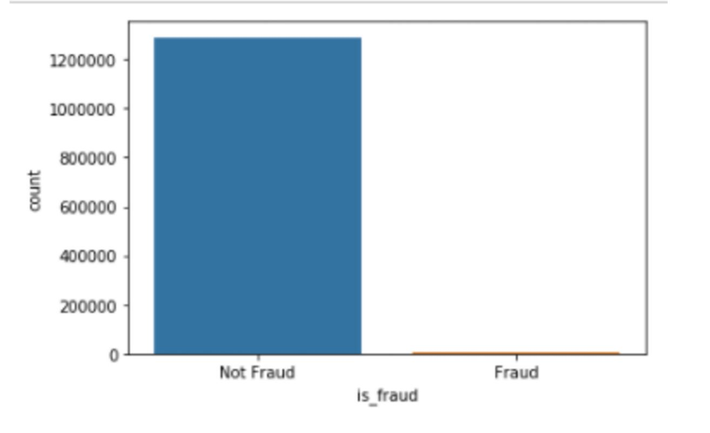
This made it so that our models would predict transactions as ‘not fraud’ every time.
Doing this would result in an accuracy of over 99%, but that is not a good metric to go by
since it caught so few frauds. We wanted to improve the recall, so we had to take some
steps to prepare our dataset for modeling.
An approach to imbalanced data is to apply data algorithms to it. We looked into
different undersampling and oversampling algorithms that we could apply to our dataset.
We used the SMOTE Oversampler and the Random Undersampler algorithms from
Python’s imbalance learn package. We tried applying each of these individually, and also
combining them to see which method resulted in the best baseline metrics for our models.
We found that applying undersampling only was the best way to improve our baseline
model scores. However, because of the way that we applied our aggregations to the data
the transactions towards the end of the dataset had more accuracy information than those
in the beginning. The random undersampling algorithm pulled transactions from all over
the dataset equally, but to maximize our model’s efficiency we wanted to use the
transactions that already had accurate aggregations applied to them. We wrote our own
code in order to undersample our dataset, focusing on the transactions that occurred later.
We undersampled the dataset down to 300,000 transactions, which greatly improved our
models. Since we applied the aggregations before we undersampled, the transactions still
benefited from the information given by the 1.3 million transaction instances. Once we
had the data algorithms applied we began to spot-check different algorithms in order to
find the most effective model for our problem.

While our data sampling algorithm helped mitigate some of the data imbalance
problem, we were still facing a largely imbalanced dataset. We spent some time
researching approaches to imbalanced learning, finding this articlewhich suggested
several models that are known to be effective on imbalanced data. We tested many of the
models discussed in the article, but a large number of them yielded very poor results.
Every model showed an accuracy of over 0.99, but that is a misleading representation of
the model’s performance in this scenario. The imbalanced dataset allows the model to
predict a valid transaction everytime and obtain an accuracy of 0.99. This means that we
need to focus on the precision and the recall of the models. The way that we identified the
effective models is by comparing the F1 score and the ROC curves. Below is a graph of
ROC curves from some different models that we tried.

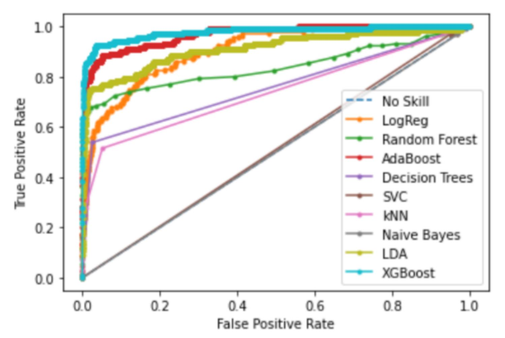
As seen in the graph above the AdaBoost and XGboost algorithms perform the
best out of the models that we plotted. We were able to obtain a precision of 0.51, a recall
of 0.59, and an F1 score of 0.55 for AdaBoost without any tuning, and we obtained a
precision of 0.80, a recall of 0.64, and an F1 score of 0.71 for XGboost. Decision Trees
and kNN performed very poorly on this dataset, while LDA performed decently well in
comparison. The metrics for LDA were significantly worse than AdaBoost though,
obtaining a precision of 0.16, a recall of 0.73, and an F1 score of just 0.26.
These results showed us that a boosting algorithm performs best on our dataset, so
we focused on these two algorithms going forward. We continued to work on the
AdaBoost algorithm, tuning the parameters to obtain the best results. We found that the
algorithm worked best with n_estimators set to 100 and a learning rate of 0.1. This
increased our F1 score from 0.55 to 0.57, which is still not as good as XGboost so we
focused mainly on that.

When researching gradient boosting algorithms we found that they can often
perform well on imbalanced datasets. We tried the algorithm initially with no applied
metrics. The XGboost performed the best out of any algorithm that we tried so far. These
results were notably better than the AdaBoost model so we decided to optimize the
XGboost as much as possible. The boosting algorithms outperformed all other types of
models for this problem.

The next step to improving our model is adjusting the parameters for the XGboost
algorithm. We used the model given from the xgboost package in Python, which is
separate from the Scikit models that we used for our other models. This package gave the
option for several different parameters to the model, but there were only a couple that
were applicable in our scenario. The first hyperparameter we looked at was the feature
weights. This allows us to set feature weights for column sampling. We used the feature
importance and correlation gathered earlier to adjust the feature weights. However, after
playing around with this it was evident that the model’s performance was not getting any
better, and in some cases it was even getting worse. The other parameter that is important
in boosting is the weight. We found a nice visualization from Analytics Vidhya that
shows the process of XGboost on an imbalanced dataset, and displays where weights will
be important in classification.

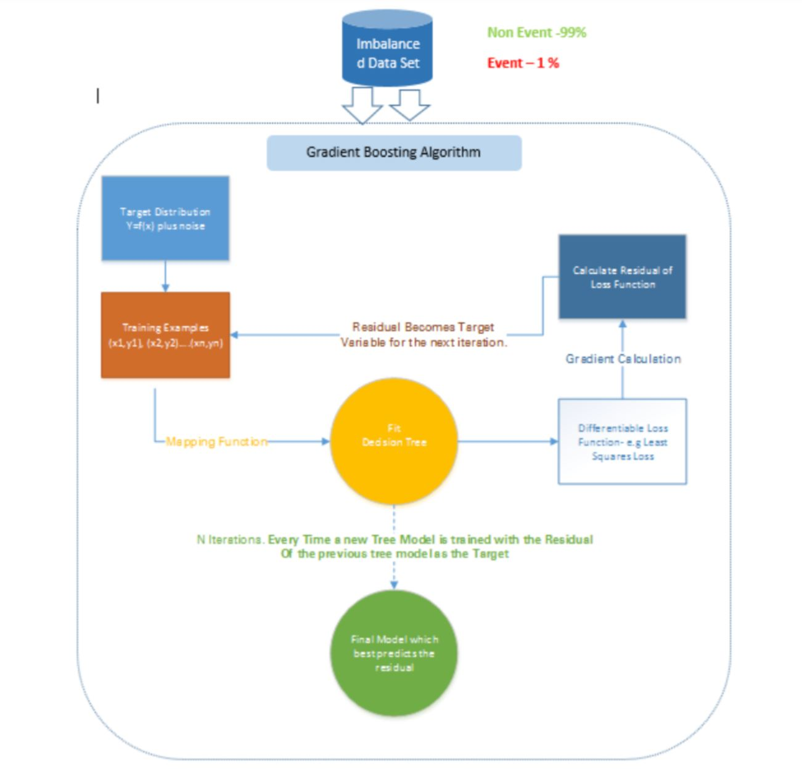
As shown in the chart above, the gradient boosting algorithm works based on the
loss function. By applying a different weight to the classes in our dataset we are able to
penalize the misclassification made by the minority class. We applied a high class weight
to the fraudulent transactions while lowering the class weights for the valid transactions.
We tested several different class weights, but none of them had as much of an impact on
the metrics as we were hoping. Our best result improved the recall from 0.64 to 0.84 for
the testing set. This was the best result that we were able to achieve in terms of recall
when adjusting the weights and the hyperparameters of our XGboost model. However, it
lowered the precision too much so we had to tune the algorithm differently in order to
deal with the tradeoff. The metrics of our final model are shown below, along with the
parameters that we applied in order to achieve these results.

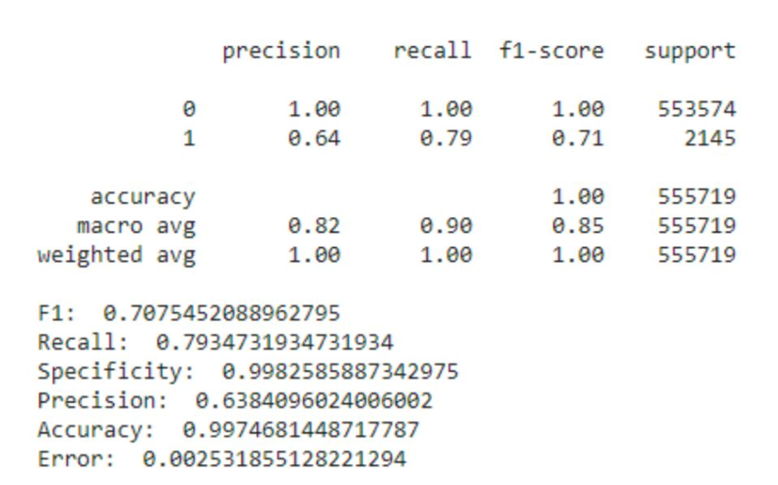
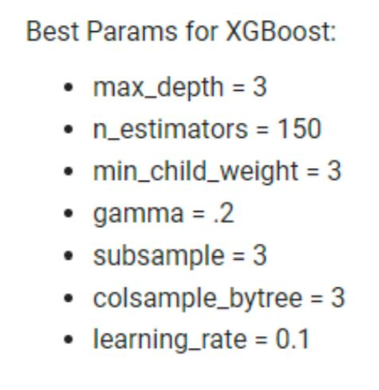
**Discussion and Result Interpretation**
Our best balanced model was able to achieve an accuracy of 0.99, a precision of
0.64, a recall of 0.79, and an F1 score of 0.71. These results are a massive improvement
from our very first models that we ran. When we first downloaded the dataset we ran
several models before doing any data sampling or feature engineering. These models
were resulting in F1 scores of below 0.10 which was a terrible starting point. We had to
combine in-depth data engineering with various data sampling techniques in order to
achieve a workable baseline model for our imbalanced dataset.
Through the model testing process we found that using ensemble boosting
algorithms was the most effective modeling technique for this problem. Many of the
other models that are said to be good at imbalanced classification, such as decision trees
and kNN, performed very badly. This was an interesting finding because finding the
algorithm that works best is so unique to the problem. There is no one model that always
works best for imbalanced data. Instead we had to try many different ones that were
suggested for imbalanced data and find which was most applicable to the credit card
fraud dataset. Once we found out that XGboost was the best model we were able to
achieve good results.
After adjusting some of the parameters of the XGboost model we were able to get
an F1 score of 0.75. However, this model had a recall of 0.70 and a precision of 0.81. Our
goal for this model was to emphasize recall over precision, so we were not satisfied with
these metrics. We tuned the model with several different parameters that adjusted this
precision recall tradeoff. We were able to get a recall of 0.84, but this resulted in a huge
decrease in precision down to 0.38. This was too large of a tradeoff, so when tuning our
model we focused on emphasizing recall while still not lowering precision by too large a
number. Our final model that we found was best balanced has a precision of 0.64 and a
recall of 0.79. These different models emphasize different metrics, and it is really up to
the end user what model would be best to use based on their use case and their goals.
The model still misses some transactions that are fraud, and also misclassifies
some valid transactions as being fraudulent. However, it is nearly impossible to correctly
classify all transactions because many fraudulent do not have any real red flags. If a
fraudulent transaction occurs close to the customer, during business hours, and at an
average purchase size, the model will most likely not pick it up as fraud. However, most
fraudulent transactions do not fall into these categories. That is why we are able to pick
up most instances of fraud, but there are still some that slip under our model’s radar.
Similarly, valid transactions are sometimes made far from a customer’s home, and at a
purchase amount higher than they usually make. Since these transactions do not follow
the typical pattern of valid transactions, the model may classify them as fraudulent even
though they are not. However, most valid transactions do not have these characteristics,
so our model classifies most valid transactions correctly.
Our main goal was to improve the recall metric so that as much fraud as possible
was identified. We concluded that it was more important for a customer to be notified of
possible fraudulent transactions, even if they were occasionally false alarms. We faced
the problem of a precision recall tradeoff, but our final model was in a spot that we were
satisfied with, having a precision of 0.64 and a recall of 0.79. This would have a real
impact on catching fraud, without excessively flagging every transaction as a possible
instance of fraud.

**Conclusion**
Credit card fraud continues to be a large problem in the modern world. Thousands
of people are affected and billions of dollars are lost every year. Our goal was to create a
model that would have a notable impact on this problem, and after much experimentation
we were able to produce an effective model. The main challenge that we faced in our
problem was the massive imbalance between valid and fraudulent transactions in our
dataset. This required us to spend a lot of our time preparing the data for analysis. Once
we had our data ready we were able to easily apply our models and compare them to each
other. The XGboost handled the imbalanced data best out of any model, and after
adjusting some parameters it produced meaningful results that would have a real impact
in mitigating the damages of credit card fraud. This problem is continually being worked

on in the real world with advanced technology and millions of data points. Through this
project we were able to identify some of the interesting aspects and difficulties involved
in solving the credit card fraud problem.

**Team Member Contribution**
Throughout this project we worked together on research, analysis, and reporting.
We did all the coding in a colab notebook, often working together in person or on a zoom
call. When we were not working simultaneously we provided each other with constant
updates. We both did independent research in order to gather new ideas for our project,
and would discuss this research together and find out how to apply it to the project. Both
the presentation and the final report were kept in a Google Drive folder that we both had
access to so we were able to both add to them and make edits to them.

